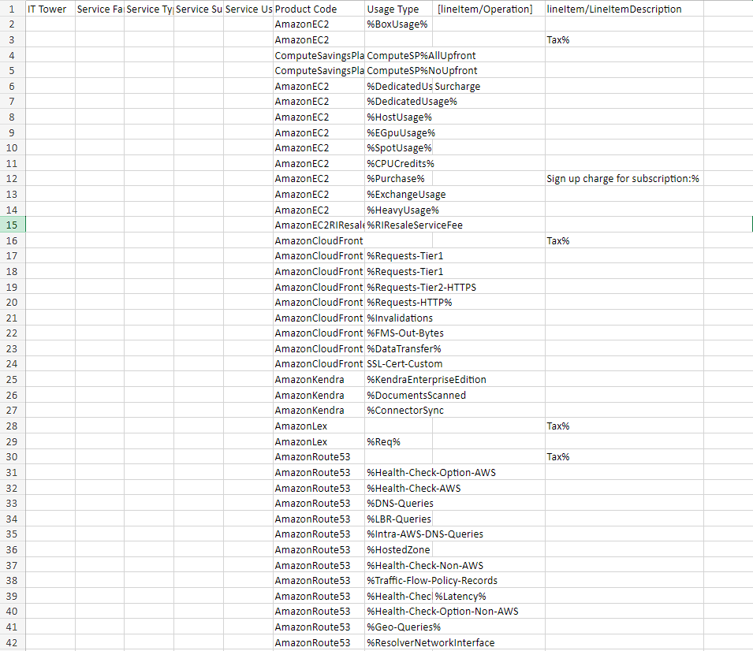

# Лабораторная работа по знакомству с облачными сервисами №1

## Состав команды
+ Белоус Ярослав(https://t.me/y0rikk) - **Капитан**
+ Райнус Анастасия (https://t.me/doriNasty) 
+ Иванова Анна (https://t.me/anuvaan) 
+ Ветошкин Ростислав (https://t.me/rost1kv)

## Цель работы:

Знакомство с облачными сервисами. Понимание уровней абстракции над инфраструктурой в облаке. Формирование понимания типов потребления сервисов в сервисной-модели. Сопоставление сервисов между разными провайдерами. Оценка возможностей миграции на отечественные сервисы.

## Дано
1. Слепок данных биллинга от провайдера после небольшой обработки в виде SQL-параметров. Символ % в начале/конце означает, что перед/после него может стоять любой набор символов.

2. Google с документациями провайдера

## Исходные данные

## Описание сервисов AWS

**Amazon EC2 (Elastic Compute Cloud)** 

Предоставляет виртуальные машины (инстансы) в облаке AWS. Этот сервис позволяет пользователям арендовать вычислительные ресурсы для различных задач. Он обеспечивает гибкость в выборе типов и характеристик инстансов, масштабируемость по требованию, готовые образы операционных систем и приложений, а также различные платежные модели, включая почасовую оплату и резервирование ресурсов на длительный срок. Amazon EC2 широко используется для развертывания и масштабирования различных приложений в облаке AWS.

**Amazon Compute Savings Plans (CSP)** - это программа скидок от Amazon Web Services (AWS), предлагающая пользователям снижение затрат на вычислительные ресурсы в облаке. В обмен на обязательство использования определенного объема ресурсов в течение 1 или 3 лет пользователи получают существенные скидки на стандартные цены (On-Demand) экземпляров.

**AmazonEC2RIResale2**

Является сервисом, позволяющим пользователям продавать свои неиспользуемые зарезервированные экземпляры Amazon EC2 другим пользователям. Это предоставляет возможность оптимизации затрат и управления ресурсами путем перепродажи ненужных резервированных экземпляров.

**AmazonCloudFront**

Представляет собой сервис глобальной доставки контента (CDN), предназначенный для ускорения распределения статических и динамических веб-контентов. CloudFront обеспечивает надежную и масштабируемую доставку контента с использованием глобальной сети кэширования, улучшая производительность веб-приложений.

**AmazonKendra** - это управляемый сервис для поиска информации в корпоративных данных и документах. Сервис использует машинное обучение для обеспечения высококачественного и точного поиска, позволяя организациям эффективно находить и получать информацию из различных источников, таких как базы данных, файлы, веб-сайты и другие.

**AmazonLex** - это служба глубокого обучения, предназначенная для создания чат-ботов и интерфейсов с использованием технологии обработки естественного языка (NLP). Amazon Lex обеспечивает возможность создания разговорных интерфейсов, которые могут взаимодействовать с пользователями на основе текста и голосовых команд.

**AmazonRoute53** - это управляемый DNS (Domain Name System) и служба маршрутизации трафика. Он предоставляет возможность регистрации доменных имен, а также управления DNS записями, позволяя обеспечивать надежное и эффективное маршрутизацию трафика в сети Интернет и внутри организации.

## Маппинг
После изучения AWS и Yandex Cloud был произведён маппинг сервисов.

|Amazon               | Yandex Cloud         |
|--------------------------|---------------------------|
| AmazonEC2                | Yandex Compute Cloud      |
| ComputeSavingsPlans      | Yandex Cloud CVoS         |
| AmazonCloudFront         | Yandex Cloud CDN          |
| AmazonKendra             | Отсутствует               |
| AmazonLex                | Yandex SpeechKit          |
| AmazonRoute53            | Yandex Cloud DNS          |

## Описание сервисов Yandex Cloud

**Yandex Compute Cloud (YCC)** - облачный сервис вычислительных ресурсов от Yandex.Cloud. Позволяет арендовать виртуальные машины, оплачивая только фактическое время их использования. Гибкий выбор конфигураций, операционных систем и настройка сети. Обеспечивает эффективное использование ресурсов и почасовую оплату.

**Yandex Cloud CVoS(Committed volume of services)**
Резервируемое потребление (Committed volume of services, CVoS) — соглашение на получение гарантированной скидки при использовании определенного объема сервисов Yandex Cloud в течение 6 месяцев или 1 года.

Если пользователь уверен в прогнозируемом и стабильном потреблении сервисов Yandex Cloud в будущем, он может подключить CVoS и сократить расходы на необходимые ресурсы.

**Yandex Cloud CDN**

Представляет собой службу, предназначенную для улучшения производительности и доставки контента в сети. Основная цель CDN - это оптимизация загрузки веб-страниц, изображений, видео и других ресурсов для конечных пользователей. Сервис использует распределенные узлы кэширования данных, размещенные близко к конечным пользователям, что позволяет снизить задержки и ускорить загрузку контента.

**Yandex SpeechKit** - это сервис, предоставляемый Яндексом, для работы с голосовыми технологиями. Сервис позволяет реализовать в приложениях и сервисах функциональность распознавания речи, синтеза речи и анализа естественного языка. С его помощью можно создавать голосовых помощников, аудиоконтент с синтезированным голосом, а также интегрировать возможности обработки и понимания речи в различные приложения и сервисы.

**Yandex Cloud DNS**

Представляет собой сервис, обеспечивающий управление доменными именами и распределение их на серверах. С его помощью пользователи могут зарегистрировать доменные имена, настраивать DNS-записи, выполнять обслуживание и обеспечивать доступность своих веб-ресурсов. Сервис предоставляет широкий набор функций, включая настройку зон, управление записями, мониторинг здоровья ресурсов и обеспечение безопасности DNS-трафика. Yandex Cloud DNS играет важную роль в обеспечении надежности и эффективности работы веб-приложений и сайтов, предоставляя удобные инструменты для управления доменами и DNS-настройками.

## Возможность миграции
Исходя из сопоставления, можно заключить, что полная переход с AWS на Yandex.Cloud в настоящий момент невозможна из-за отсутствия некоторых сервисов. Однако большинство услуг можно перенести уже сейчас.

## Итоговая таблица
Результатом нашей работы является заполненная таблица. 

| IT Tower               | Service Family              | Service Type                      | Service Sub Type             | Service Usage Type             | Product Code            | Usage Type                | [lineItem/Operation]      | [lineItem/LineItemDescription]            | Yandex Cloud Service     |
|------------------------|-----------------------------|-----------------------------------|------------------------------|--------------------------------|-------------------------|---------------------------|---------------------------|-----------------------------------------|--------------------------|
| Compute                 | Compute                     | Elastic Compute Cloud             | Standard Instances           | Box Usage                      | AmazonEC2               | %BoxUsage%                |                           |                                          | Yandex Compute Cloud     | 
| Compute                       |  Compute                           | Elastic Compute Cloud                               |                              | Tax%                           | AmazonEC2               |                          |                           |                                          | Yandex Compute Cloud     |
| Infrastructure          | Compute                     | Savings Plans                     | All Upfront                   | Compute Savings Plans All Upfront | ComputeSavingsPlans      | %ComputeSPAllUpfront%     |                           |                                          | Yandex Cloud CVoS        |
| Infrastructure          | Compute                     | Savings Plans                     | No Upfront                    | Compute Savings Plans No Upfront  | ComputeSavingsPlans      | %ComputeSPNoUpfront%      |                           |                                          |                          |
| Compute                 | Compute                     | Elastic Compute Cloud             | Dedicated Instances           | Dedicated Usage                | AmazonEC2               | %DedicatedUsage%         | Surcharge                 |                                          | Yandex Compute Cloud     |
| Compute                 | Compute                     | Elastic Compute Cloud             | Dedicated Instances           | Dedicated Usage                | AmazonEC2               | %DedicatedUsage%         |                           |                                          | Yandex Compute Cloud     |
| Compute                 | Compute                     | Elastic Compute Cloud             | Hosts                        | Host Usage                     | AmazonEC2               | %HostUsage%              |                           |                                          | Yandex Compute Cloud     |
| Compute                 | Compute                     | Elastic Compute Cloud             | GPU Instances                 | GPU Usage                      | AmazonEC2               | %EGpuUsage%              |                           |                                          | Yandex Compute Cloud     |
| Compute                 | Compute                     | Elastic Compute Cloud             | Spot Instances                | Spot Usage                     | AmazonEC2               | %SpotUsage%              |                           |                                          | Yandex Compute Cloud     |
| Compute                 | Compute                     | Elastic Compute Cloud             | Standard Instances             | CPU Credits                    | AmazonEC2               | %CPUCredits%             |                           |                                          | Yandex Compute Cloud     |
| Compute                 | Compute                     | Elastic Compute Cloud             | On-Demand Instances            | Purchase                       | AmazonEC2               | %Purchase%               |                           | Sign up charge for subscription:%       | Yandex Compute Cloud     |
| Compute                 | Compute                     | Elastic Compute Cloud             | Reserved Instances Exchange    | Exchange Usage                 | AmazonEC2               | %ExchangeUsage%          |                           |                                          | Yandex Compute Cloud     |
| Compute                 | Compute                     | Elastic Compute Cloud             | Heavy Utilization Instances    | Heavy Usage                    | AmazonEC2               | %HeavyUsage%             |                           |                                          | Yandex Compute Cloud     |
| Infrastructure          | Compute                     | Virtual Server                    | Reserved Instances Resale       | Service Fee                    | AmazonEC2RIResale2      | %RIResaleServiceFee%     |                           |                                          | Yandex Compute Cloud     |
| Network                 | Content Delivery             | Content Delivery Network (CDN)    | Standard                       | Data Transfer                  | AmazonCloudFront        |                          | Tax%                      |                                          | Yandex Cloud CDN         |
| Network                 | Content Delivery             | Content Delivery Network (CDN)    | Requests                       | Tier 1                         | AmazonCloudFront        | %Requests-Tier1%         |                           |                                          | Yandex Cloud CDN         |
| Network                 | Content Delivery             | Content Delivery Network (CDN)    | Requests                       | Tier 1                         | AmazonCloudFront        | %Requests-Tier1%         |                           |                                          | Yandex Cloud CDN         |
| Network                 | Content Delivery             | Content Delivery Network (CDN)    | Requests                       | Tier 2 (HTTPS)                 | AmazonCloudFront        | %Requests-Tier2-HTTPS%   |                           |                                          | Yandex Cloud CDN         |
| Network                 | Content Delivery             | Content Delivery Network (CDN)    | Requests                       | HTTP Requests                  | AmazonCloudFront        | %Requests-HTTP%          |                           |                                          | Yandex Cloud CDN         |
| Network                 | Content Delivery             | Content Delivery Network (CDN)    | Invalidation                   | Requests Invalidation           | AmazonCloudFront        | %Invalidations%          |                           |                                          | Yandex Cloud CDN         |
| Network                 | Content Delivery             | Content Delivery Network (CDN)    | Data Transfer                  | FMS Out Bytes                  | AmazonCloudFront        | %FMS-Out-Bytes%          |                           |                                          | Yandex Cloud CDN         |
| Network                 | Content Delivery             | Content Delivery Network (CDN)    | Data Transfer                  | Standard Data Transfer          | AmazonCloudFront        | %DataTransfer%           |                           |                                          | Yandex Cloud CDN         |
| Network                 | Content Delivery             | Content Delivery Network (CDN)    | SSL Certificate                | Custom SSL Certificate          | AmazonCloudFront        | SSL-Cert-Custom          |                           |                                          | Yandex Cloud CDN         |
| Information             | Enterprise Search            | Search                            | Kendra                         | Enterprise Edition              | AmazonKendra            | %KendraEnterpriseEdition%|                           |                                          |                          |
| Information             | Enterprise Search            | Search                            | Kendra                         | Documents Scanned               | AmazonKendra            | %DocumentsScanned%       |                           |                                          |                          |
| Information             | Enterprise Search            | Search                            | Kendra                         | Connector Sync                  | AmazonKendra            | %ConnectorSync%          |                           |                                          |                          |
| Information             | AI and Machine Learning      | Conversational Interfaces         | Lex                            |                                | AmazonLex               |                          | Tax%                      |                                          | Yandex SpeechKit         |
| Information             | AI and Machine Learning      | Conversational Interfaces         | Lex                            | Requests                       | AmazonLex               | %Req%                    |                           |                                          | Yandex SpeechKit         |
| Network                 | Domain Name System (DNS)     | DNS                               | Route 53                       |                                | AmazonRoute53           |                          | Tax%                      |                                          | Yandex Cloud DNS         |
| Network                 | Domain Name System (DNS)     | DNS                               | Route 53 Health Check           | Option AWS                     | AmazonRoute53           | %Health-Check-Option-AWS%|                           |                                          | Yandex Cloud DNS         |
| Network                 | Domain Name System (DNS)     | DNS                               | Route 53 Health Check           | AWS Health Check                | AmazonRoute53           | %Health-Check-AWS%       |                           |                                          | Yandex Cloud DNS         |
| Network                 | Domain Name System (DNS)     | DNS                               | Route 53 Queries                | DNS Queries                    | AmazonRoute53           | %DNS-Queries%            |                           |                                          | Yandex Cloud DNS         |
| Network                 | Domain Name System (DNS)     | DNS                               | Route 53 Queries                | Latency-Based Routing Queries   | AmazonRoute53           | %LBR-Queries%            |                           |                                          | Yandex Cloud DNS         |
| Network                 | Domain Name System (DNS)     | DNS                               | Route 53 Queries                | Intra-AWS DNS Queries           | AmazonRoute53           | %Intra-AWS-DNS-Queries%  |                           |                                          | Yandex Cloud DNS         |
| Network                 | Domain Name System (DNS)     | DNS                               | Hosted Zone                     | Hosted Zone                    | AmazonRoute53           | %HostedZone%             |                           |                                          | Yandex Cloud DNS         |
| Network                 | Domain Name System (DNS)     | DNS                               | Health Check                    | Non-AWS Health Check            | AmazonRoute53           | %Health-Check-Non-AWS%   |                           |                                          | Yandex Cloud DNS         |
| Network                 | Domain Name System (DNS)     | DNS                               | Traffic Flow                    | Policy Records                 | AmazonRoute53           | %Traffic-Flow-Policy-Records%|                        |                                          | Yandex Cloud DNS         |
| Network                 | Domain Name System (DNS)     | DNS                               | Health Check                    | Latency Health Check            | AmazonRoute53           | %Health-Check% %Latency%  |                           |                                          | Yandex Cloud DNS         |
| Network                 | Domain Name System (DNS)     | DNS                               | Health Check                    | Option Non-AWS                  | AmazonRoute53           | %Health-Check-Option-Non-AWS%|                        |                                          | Yandex Cloud DNS         |
| Network                 | Domain Name System (DNS)     | DNS                               | Geo Queries                     | Geo DNS Queries                 | AmazonRoute53           | %Geo-Queries%            |                           |                                          | Yandex Cloud DNS         |
| Network                 | Domain Name System (DNS)     | DNS                               | Resolver                        | Network Interface               | AmazonRoute53           | %ResolverNetworkInterface%|                        |                                          | Yandex Cloud DNS         |

## Вывод
В результате выполнения данной лабораторной работы мы создали и заполнили таблицу данных, извлеченных из документации Amazon. Проанализировали и описали несколько сервисов, а также получили информацию о подтипах этих сервисов и других их характеристиках. Мы успешно достигли поставленной цели работы, сформировав понимание типов потребления сервисов в сервисной модели.

